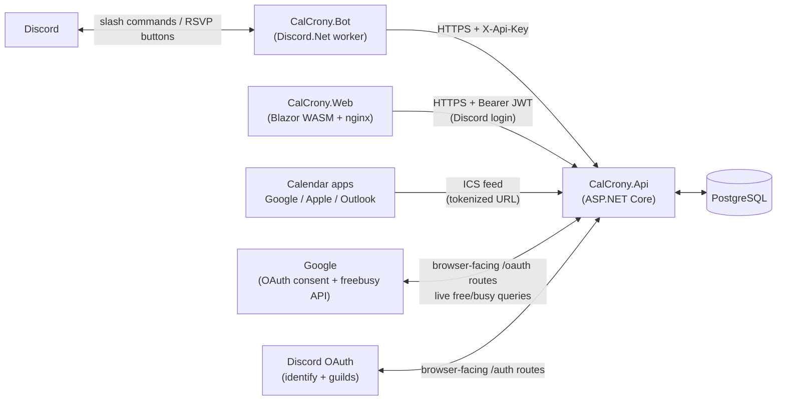

# CalCrony

A self-hosted event & calendar suite for Discord, inspired by [sesh.fyi](https://sesh.fyi/), built in .NET 9 — a Discord bot **and** a browser app over one API.

**Architecture:** the backend is an API (`CalCrony.Api`); the Discord bot (`CalCrony.Bot`) is a pure client of that API authenticating with an `X-Api-Key` header, and the web app (`CalCrony.Web`, Blazor WebAssembly) is a second client authenticating with Discord-login JWTs. The API owns all domain logic, persistence (PostgreSQL/EF Core), scheduling, ICS generation, and both OAuth dances (Google calendar-linking and Discord web login) — it knows nothing about Discord.Net and stores Discord snowflakes as opaque IDs. Shared DTOs live in `CalCrony.Contracts`. Scheduled sends (reminders, event pings) and web→Discord embed syncs flow through an outbox: the API materializes due `Delivery` rows; the bot polls and acks each only after the Discord action succeeds.



## Features

- **Events** — natural-language datetimes ("tomorrow 6pm", "in 5 hours"), rich embeds, creator/manager-only edit & delete, timezone-aware throughout (NodaTime; per-user and per-server timezones)
- **RSVPs** — one-click buttons (✅/❌/🤔) with live-updating attendee lists on the embed
- **Reminders & notifications** — one-off `/remind`, up to 5 scheduled pings per event plus an automatic start announcement, crash-safe delivery via the outbox
- **ICS calendar feed** — per-server tokenized subscribe URL (`/link`), importable into Google/Apple/Outlook calendars; recurring events include their full schedule (RRULE), so subscribers see every future occurrence, not just the next one
- **Google Calendar availability** — members link their Google Calendar via OAuth (least-privilege free/busy scope: CalCrony never sees event titles or details, and tokens are encrypted at rest); anyone can then check an on-demand, Teams-Scheduling-Assistant-style free/busy grid for a role or an event's attendees. Read-only — it never blocks creating or RSVPing.
- **Recurring events** — every-N days/weeks/months schedules (monthly by date or by nth weekday, e.g. "3rd Friday"), anchored on the first occurrence with timezone-aware math (8pm stays 8pm across DST); rolling next occurrence sesh-style — when one ends or is skipped, the next posts automatically; end by date or count; edits ask "this occurrence or the whole series?"; the rule and end condition are editable after creation, and editing an ended series revives it (making stop reversible)
- **Polls & time polls** — up to 10 options, single- or multi-vote, anonymous mode, voter-added options (➕ opens a modal), natural-language close deadlines with automatic closing, live bar-graph results on the embed — and a closed time poll's winning slot converts into a real event with one click.
- **Discord native events** — opt-in per server (`/settings native-events on`): events mirror into Discord's built-in Events tab with full lifecycle sync (created/updated/deleted, marked active at start and completed at end); the native description points at the RSVP embed so "Interested" isn't mistaken for an RSVP. Requires the bot to hold **Manage Events** (on the current invite link; servers that added the bot earlier must re-invite or grant it to the bot's role).
- **Event templates** — save any event's setup (content, reminders, repeat rule) as a named template, then start new events from it with `/create template:` or the web form's picker; up to 25 per server
- **Attendee roles** — pick an existing role at `/create attendee-role:` and everyone who RSVPs "Going" gets it automatically (revoked when they switch away, un-RSVP, or the event ends/is deleted); great for event pings and temporary channel access. Requires the bot to hold **Manage Roles** with the picked role below its own.
- **Event threads** — `/create thread:true` (or the web form's checkbox) opens a discussion thread on the event message; "Going" RSVPers are added automatically so they get its notifications, and the thread archives when the event ends, is deleted, skipped, or cancelled — history stays readable. Requires the bot to hold **Create Public Threads** (on the current invite link; servers that added the bot earlier must re-invite or grant it).
- **Web app** — sign in with Discord (identify + guilds scopes only) and use your servers' events in a mobile-first, dark-by-default UI: create, edit, and delete events (embeds post/update/disappear in Discord automatically), RSVP from the browser, manage notifications, set reminders, edit server & personal settings, see availability grids, link your calendar, grab the ICS subscribe URL. Polls work here too: create standard or time polls with live parse previews, vote, add options, close, and convert a time poll's winner into an event. Recurring events are fully manageable from the browser: repeat controls with live previews on the form, skip/stop from the event page, and per-occurrence vs whole-series choices on edits and notifications. Web-created events and polls post to the server's default channel, set once with `/settings default-channel`.

## Commands

> **First steps after inviting the bot** (server admins, once per server):
> `/settings server-timezone` — pick your zone from the command's suggestions (start typing a city, e.g. `America/Chicago`); natural-language times parse in this zone, and until it's set the server runs on UTC, so local wall-clock times can land hours off or be rejected as past. Then `/settings default-channel` pointing at your events channel — web-created events, polls, and reminders post there, and web creation is blocked until it's set.

| Command | What it does |
|---|---|
| `/create title when [description duration channel location image repeat...]` | Create an event; `when` is natural language, `repeat` options make it recurring, `template` starts from a saved template, `attendee-role` grants a role to Going RSVPs, `thread` opens a discussion thread |
| `/list [channel] [limit]` | Upcoming events |
| `/edit name [fields...] [scope]` / `/delete name` | Edit/delete by (partial) title — creator or server manager only; repeating events need `scope` (this occurrence / whole series); `attendee-role` / `clear-attendee-role` change or remove the granted role |
| `/series skip name` · `/series stop name` · `/series info name` | Skip a repeating event's next occurrence · stop it repeating · see its schedule |
| `/series edit name [repeat repeat-every ends until count]` | Change a series' rule or end condition — editing an ended series revives it |
| `/remind when about` | One-off reminder in the current channel |
| `/notify event minutes-before [message mention channel]` | Add a scheduled ping before an event starts (max 5) |
| `/poll create question options [single-vote anonymous allow-options closes]` | Create a poll; `options` is comma-separated, `closes` is natural language |
| `/poll time question slots [anonymous allow-options closes]` | Time poll — `slots` are natural-language datetimes, voters pick every time they can make |
| `/poll close name` / `/poll convert name [title duration]` | Close a poll · turn a closed time poll's winner into an event |
| `/template save name event` · `/template list` · `/template delete name` | Save an event's setup for reuse · browse · delete (creator or manager) |
| `/settings view` · `/settings timezone` · `/settings server-timezone` · `/settings default-channel` · `/settings native-events` | Personal & server timezone · where web-created embeds post · mirror events to the server's Events tab |
| `/timestamp when` | Convert natural language into Discord `<t:...>` codes |
| `/link` | This server's ICS subscribe URL |
| `/calendar connect` · `status` · `disconnect` | Link/unlink your Google Calendar (works in DMs) |
| `/availability role role when [duration]` | Free/busy grid for everyone holding a role |
| `/availability event name` | Free/busy grid for everyone RSVP'd Going, over the event's own window |

## Solution layout

```
src/
  CalCrony.Api/        ASP.NET Core: endpoints, EF Core + migrations, scheduler, ICS, OAuth (Google + Discord)
  CalCrony.Bot/        Discord.Net worker: slash commands, RSVP buttons, delivery poller
  CalCrony.Web/        Blazor WASM app: landing/docs + Discord-login app, served by nginx
  CalCrony.Contracts/  DTOs shared across the wire
tests/
  CalCrony.Api.Tests/  Parser unit tests + Testcontainers-Postgres integration tests
  CalCrony.Bot.Tests/  Embed-builder unit tests
  CalCrony.Web.Tests/  bUnit component tests
```

## Configuration

All settings can be supplied as environment variables using `Section__Key` form.

### API (`CalCrony.Api`)

| Setting | Default | Purpose |
|---|---|---|
| `ConnectionStrings__CalCrony` | localhost dev string | PostgreSQL connection |
| `Database__AutoMigrate` | `true` | Apply EF migrations + seed bootstrap key at startup |
| `Auth__BootstrapApiKey` | *(empty)* | Seeded (SHA-256-hashed) **only when the ApiKeys table is empty** |
| `Scheduler__Enabled` / `Scheduler__SweepSeconds` | `true` / `15` | Notification/start-ping sweep loop |
| `Retention__Enabled` / `Retention__Days` / `Retention__SweepHours` | `true` / `90` / `24` | Daily purge of done rows (sent/failed deliveries, expired login/refresh/link tokens) older than the window; pending deliveries are never purged |
| `Api__PublicBaseUrl` | *(empty)* | The API's public HTTPS URL — required for Google OAuth and Discord login (`redirect_uri`s are built from it) |
| `Calendar__Google__ClientId` / `ClientSecret` | *(empty)* | Google OAuth Web-client credentials; calendar features return a clear 503 until set |
| `Calendar__DataProtectionKeyPath` | `./keys` | **Must be persisted storage.** Encryption keys for stored OAuth tokens live here; losing them silently bricks every linked calendar |
| `Auth__Discord__ClientId` / `ClientSecret` | *(empty)* | Discord application credentials for web login; `/auth/discord/start` returns a clear 503 until set |
| `Auth__Jwt__SigningKey` | *(empty)* | HS256 key (≥32 chars) for web-session JWTs; rotating it just signs everyone out |
| `Web__Origin` | *(empty)* | The web app's public origin — drives CORS, login redirects, and returnUrl validation |

Anonymous routes (no credential): `/health`, `/feeds/*` (token in URL), `/oauth/*` (single-use link tokens), `/auth/*` (login redirects + HttpOnly refresh cookie). Everything else accepts the bot's `X-Api-Key` **or** a web-session Bearer JWT — web callers are scoped to their own guilds/identity, the bot is fully trusted.

### Bot (`CalCrony.Bot`)

| Setting | Default | Purpose |
|---|---|---|
| `Discord__BotToken` | *(empty)* | Bot token; without it the bot logs a warning and idles |
| `Discord__TestGuildId` | *(empty)* | If set, slash commands register to that guild instantly; otherwise globally (can take up to an hour) |
| `Api__BaseUrl` / `Api__ApiKey` | `http://localhost:8080` / — | How the bot reaches the API |
| `Api__PublicBaseUrl` | falls back to `Api__BaseUrl` | Public URL used when showing the ICS feed link |
| `Api__PollSeconds` | `15` | Outbox polling cadence |

The `/availability role` command requires the **Server Members** privileged gateway intent, enabled in the Discord Developer Portal.

## Running locally

```bash
docker compose up -d postgres          # just the database
dotnet run --project src/CalCrony.Api  # API on the launch profile port
dotnet test CalCrony.slnx              # full suite; Docker must be running (Testcontainers)
```

Or the whole stack: `docker compose up` (set `DISCORD_BOT_TOKEN`, `CALCRONY_API_KEY`, and optionally the `GOOGLE_OAUTH_*`/`CALCRONY_DB_*` variables — see `docker-compose.yml` for the full list and their dev defaults).

## Deploying

Releases publish versioned Docker images: `ghcr.io/jjwren/calcrony-api`, `ghcr.io/jjwren/calcrony-bot`, and `ghcr.io/jjwren/calcrony-web` (nginx-served static app; set `API_BASE_URL` to the browser-visible API URL). A production deployment is the compose file pointed at those images instead of `build:`, with:

1. A strong `CALCRONY_API_KEY` set **before first boot** (the bootstrap key only seeds into an empty database).
2. A named volume behind `Calendar__DataProtectionKeyPath` (see the warning above).
3. The API fronted by a reverse proxy at a public HTTPS URL, with `Api__PublicBaseUrl` set to it, and `{Api__PublicBaseUrl}/oauth/google/callback` registered as an authorized redirect URI on your Google OAuth client.
4. A Discord application with the bot token, `bot` + `applications.commands` scopes on the invite, and the Server Members intent enabled — plus, for web login, `{Api__PublicBaseUrl}/auth/discord/callback` added to the same application's OAuth2 redirect URIs and its client id/secret in `Auth__Discord__*`.

The running API reports its version at `GET /health`.

## Contributing, releases & security

All changes flow through PRs on GitHub Flow branches with conventional-commit titles; `master` is protected by a ruleset (required review, Copilot review, required checks, squash-only). Releases are cut automatically by release-please and published to GHCR. See [CONTRIBUTING.md](CONTRIBUTING.md) for the full process and [SECURITY.md](SECURITY.md) for how to report vulnerabilities.
