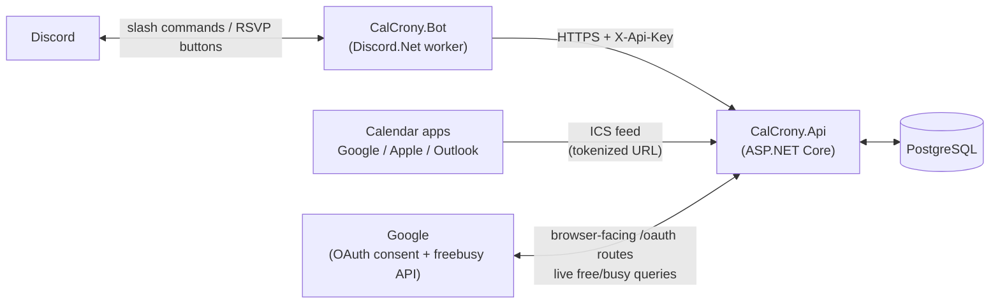

# CalCrony

A self-hosted event & calendar bot for Discord, inspired by [sesh.fyi](https://sesh.fyi/), built in .NET 9.

**Architecture:** the backend is an API (`CalCrony.Api`); the Discord bot (`CalCrony.Bot`) is a pure client of that API, authenticating with an `X-Api-Key` header. The API owns all domain logic, persistence (PostgreSQL/EF Core), scheduling, ICS generation, and Google OAuth — it knows nothing about Discord.Net and stores Discord snowflakes as opaque IDs. Shared DTOs live in `CalCrony.Contracts`. Scheduled sends (reminders, event pings) flow through an outbox: the API materializes due `Delivery` rows; the bot polls and acks each only after the Discord post succeeds.



## Features

- **Events** — natural-language datetimes ("tomorrow 6pm", "in 5 hours"), rich embeds, creator/manager-only edit & delete, timezone-aware throughout (NodaTime; per-user and per-server timezones)
- **RSVPs** — one-click buttons (✅/❌/🤔) with live-updating attendee lists on the embed
- **Reminders & notifications** — one-off `/remind`, up to 5 scheduled pings per event plus an automatic start announcement, crash-safe delivery via the outbox
- **ICS calendar feed** — per-server tokenized subscribe URL (`/link`), importable into Google/Apple/Outlook calendars
- **Google Calendar availability** — members link their Google Calendar via OAuth (least-privilege free/busy scope: CalCrony never sees event titles or details, and tokens are encrypted at rest); anyone can then check an on-demand, Teams-Scheduling-Assistant-style free/busy grid for a role or an event's attendees. Read-only — it never blocks creating or RSVPing.

## Commands

| Command | What it does |
|---|---|
| `/create title when [description duration channel location image]` | Create an event; `when` is natural language |
| `/list [channel] [limit]` | Upcoming events |
| `/edit name [fields...]` / `/delete name` | Edit/delete by (partial) title — creator or server manager only |
| `/remind when about` | One-off reminder in the current channel |
| `/notify event minutes-before [message mention channel]` | Add a scheduled ping before an event starts (max 5) |
| `/settings view` · `/settings timezone` · `/settings server-timezone` | Personal & server timezone (IANA ids) |
| `/timestamp when` | Convert natural language into Discord `<t:...>` codes |
| `/link` | This server's ICS subscribe URL |
| `/calendar connect` · `status` · `disconnect` | Link/unlink your Google Calendar (works in DMs) |
| `/availability role role when [duration]` | Free/busy grid for everyone holding a role |
| `/availability event name` | Free/busy grid for everyone RSVP'd Going, over the event's own window |

## Solution layout

```
src/
  CalCrony.Api/        ASP.NET Core: endpoints, EF Core + migrations, scheduler, ICS, Google OAuth
  CalCrony.Bot/        Discord.Net worker: slash commands, RSVP buttons, delivery poller
  CalCrony.Contracts/  DTOs shared across the wire
tests/
  CalCrony.Api.Tests/  Parser unit tests + Testcontainers-Postgres integration tests
  CalCrony.Bot.Tests/  Embed-builder unit tests
```

## Configuration

All settings can be supplied as environment variables using `Section__Key` form.

### API (`CalCrony.Api`)

| Setting | Default | Purpose |
|---|---|---|
| `ConnectionStrings__CalCrony` | localhost dev string | PostgreSQL connection |
| `Database__AutoMigrate` | `true` | Apply EF migrations + seed bootstrap key at startup |
| `Auth__BootstrapApiKey` | *(empty)* | Seeded (SHA-256-hashed) **only when the ApiKeys table is empty** |
| `Scheduler__Enabled` / `Scheduler__SweepSeconds` | `true` / `15` | Notification/start-ping sweep loop |
| `Api__PublicBaseUrl` | *(empty)* | The API's public HTTPS URL — required for Google OAuth (`redirect_uri` and connect links are built from it) |
| `Calendar__Google__ClientId` / `ClientSecret` | *(empty)* | Google OAuth Web-client credentials; calendar features return a clear 503 until set |
| `Calendar__DataProtectionKeyPath` | `./keys` | **Must be persisted storage.** Encryption keys for stored OAuth tokens live here; losing them silently bricks every linked calendar |

Anonymous routes (no API key): `/health`, `/feeds/*` (token in URL), `/oauth/*` (single-use link tokens).

### Bot (`CalCrony.Bot`)

| Setting | Default | Purpose |
|---|---|---|
| `Discord__BotToken` | *(empty)* | Bot token; without it the bot logs a warning and idles |
| `Discord__TestGuildId` | *(empty)* | If set, slash commands register to that guild instantly; otherwise globally (can take up to an hour) |
| `Api__BaseUrl` / `Api__ApiKey` | `http://localhost:8080` / — | How the bot reaches the API |
| `Api__PublicBaseUrl` | falls back to `Api__BaseUrl` | Public URL used when showing the ICS feed link |
| `Api__PollSeconds` | `15` | Outbox polling cadence |

The `/availability role` command requires the **Server Members** privileged gateway intent, enabled in the Discord Developer Portal.

## Running locally

```bash
docker compose up -d postgres          # just the database
dotnet run --project src/CalCrony.Api  # API on the launch profile port
dotnet test CalCrony.slnx              # full suite; Docker must be running (Testcontainers)
```

Or the whole stack: `docker compose up` (set `DISCORD_BOT_TOKEN`, `CALCRONY_API_KEY`, and optionally the `GOOGLE_OAUTH_*`/`CALCRONY_DB_*` variables — see `docker-compose.yml` for the full list and their dev defaults).

## Deploying

Releases publish versioned Docker images: `ghcr.io/jjwren/calcrony-api` and `ghcr.io/jjwren/calcrony-bot`. A production deployment is the compose file pointed at those images instead of `build:`, with:

1. A strong `CALCRONY_API_KEY` set **before first boot** (the bootstrap key only seeds into an empty database).
2. A named volume behind `Calendar__DataProtectionKeyPath` (see the warning above).
3. The API fronted by a reverse proxy at a public HTTPS URL, with `Api__PublicBaseUrl` set to it, and `{Api__PublicBaseUrl}/oauth/google/callback` registered as an authorized redirect URI on your Google OAuth client.
4. A Discord application with the bot token, `bot` + `applications.commands` scopes on the invite, and the Server Members intent enabled.

The running API reports its version at `GET /health`.

## Contributing, releases & security

All changes flow through PRs on GitHub Flow branches with conventional-commit titles; `master` is protected by a ruleset (required review, Copilot review, required checks, squash-only). Releases are cut automatically by release-please and published to GHCR. See [CONTRIBUTING.md](CONTRIBUTING.md) for the full process and [SECURITY.md](SECURITY.md) for how to report vulnerabilities.
