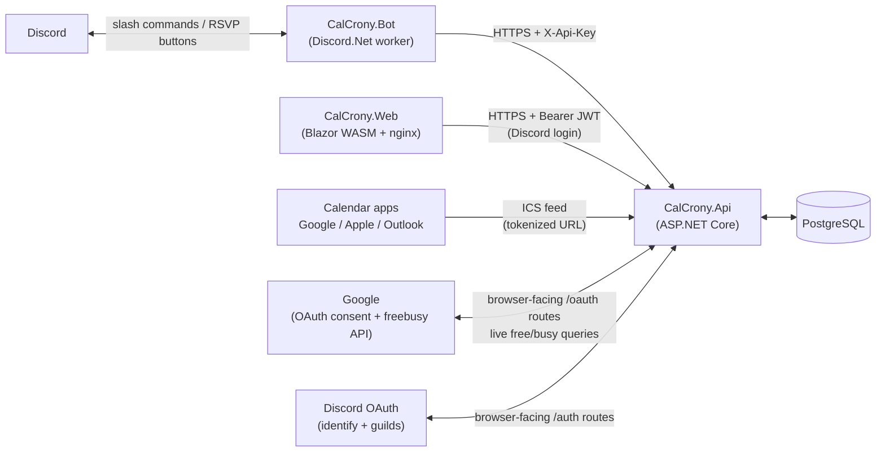

# CalCrony

[](https://discord.gg/aEdYyZYgyV)
[](https://www.buymeacoffee.com/jmykitta)

Hosted at [calcrony.app](https://calcrony.app), or run your own — an event & calendar suite for Discord, inspired by [sesh.fyi](https://sesh.fyi/), built in .NET 10: a Discord bot **and** a browser app over one API.

**Architecture:** the backend is an API (`CalCrony.Api`); the Discord bot (`CalCrony.Bot`) is a pure client of that API authenticating with an `X-Api-Key` header, and the web app (`CalCrony.Web`, Blazor WebAssembly) is a second client authenticating with Discord-login JWTs. The API owns all domain logic, persistence (PostgreSQL/EF Core), scheduling, ICS generation, and both OAuth dances (Google calendar-linking and Discord web login) — it knows nothing about Discord.Net and stores Discord snowflakes as opaque IDs. Shared DTOs live in `CalCrony.Contracts`. Scheduled sends (reminders, event pings) and web→Discord embed syncs flow through an outbox: the API materializes due `Delivery` rows; the bot polls and acks each only after the Discord action succeeds.


```mermaid
flowchart LR
    discord["Discord"] <-- "slash commands / RSVP buttons" --> bot["CalCrony.Bot<br/>(Discord.Net worker)"]
    bot -- "HTTPS + X-Api-Key" --> api["CalCrony.Api<br/>(ASP.NET Core)"]
    web["CalCrony.Web<br/>(Blazor WASM + nginx)"] -- "HTTPS + Bearer JWT<br/>(Discord login)" --> api
    api <--> db[("PostgreSQL")]
    calapps["Calendar apps<br/>Google / Apple / Outlook"] -- "ICS feed<br/>(tokenized URL)" --> api
    google["Google<br/>(OAuth consent + freebusy API)"] <-- "browser-facing /oauth routes<br/>live free/busy queries" --> api
    discordoauth["Discord OAuth<br/>(identify + guilds)"] <-- "browser-facing /auth routes" --> api
```

## Features

Most features work from both Discord and the web app; roles, restrictions and live lists are set in Discord, while themes, the activity log and the CSV export live on the web. Anything marked **opt-in** stays off until turned on. The [user docs](https://calcrony.app/docs#features) cover each feature in full: how to reach it, the permission it needs, defaults and caveats.

**Events & RSVPs**
- Events from plain English ("tomorrow 6pm"), timezone-aware per user and server; creators and managers edit.
- RSVP buttons with live attendee lists; custom options (any emoji + label, up to 10), one marked *attending* for roles, threads and availability.
- Attendee limits with an automatic waitlist (`attendee-limit:6`, or `xN` per option); close RSVPs early with `rsvp-close:"2h before"`.
- Multiple RSVPs per member, **opt-in** per event (`multi-rsvp:true`): be Tank *and* Healer; clicking a chosen option again removes it.
- Discussion threads (`thread:true`) that attending RSVPers join automatically; archived when the event ends.
- Event templates (`/template save`, then `/create template:`), up to 25 per server.
- Discord native events, **opt-in** per server (`/settings native-events enabled:true`).

**Schedules**
- Recurring events every N days, weeks, months or years, with day sets and nth-weekday rules, DST-safe; the next occurrence posts itself.
- Live list (`/livelist create`): an upcoming-events embed the bot keeps current, one per channel.

**Reminders & calendars**
- Up to 5 scheduled pings per event (`/notify`), a start announcement, and one-off `/remind`, all crash-safe.
- DM reminders, **opt-in** per user only.
- ICS subscribe feed per server (`/link`) with full recurrence; **opt-in** public web calendar behind an unguessable link.
- Google Calendar free/busy grids (`/availability`) for a role or an event's attendees, free/busy scope only.

**Polls**
- Standard and time polls: up to 10 options, single or multi vote, anonymous, voter-added options, auto-close, live bars; a time poll's winner becomes an event.

**Roles & access**
- Attendee roles: a role granted on RSVP and revoked on leaving or at event end, event-wide (`attendee-role:`) or per option (`rsvp-options:"🛡️ Tank @tank, 💚 Healer @healer"`).
- Role-restricted signup for events and polls (`restrict-to:@Raiders`, or `only: @role` per option); the web fails closed.

**Web app & admin**
- Sign in with Discord (identify + guilds only) and manage events, RSVPs, polls, templates, notifications and settings from a mobile-first UI with five themes.
- Activity log (90 days) and CSV export of every event and RSVP, for managers.

## Commands

> **First steps after inviting the bot** (server admins, once per server):
> `/settings server-timezone` — pick your zone from the command's suggestions (start typing a city, e.g. `America/Chicago`); natural-language times parse in this zone, and until it's set the server runs on UTC, so local wall-clock times can land hours off or be rejected as past. Then `/settings default-channel` pointing at your events channel — web-created events, polls, and reminders post there, and web creation is blocked until it's set.
>
> **Then set up your roles** — two kinds, used differently: standing **interest roles** members self-assign and keep (e.g. `@dnd`, `@movie-night`) are what you point `/availability role` and `/notify mention:` at; empty **attendee roles** (e.g. `@session-players`) are what you pass to `/create attendee-role:` — CalCrony grants them to "Going" RSVPs and empties them when the event ends. ⚠️ Never use a standing role as an attendee role (it gets emptied at event end), and keep bot-managed roles below the bot's own role. Worked example — a self-running weekly game night:
>
> ```text
> /availability role role:@dnd when:"friday 7pm" duration:180        ← check the group first
> /create title:"D&D Night" when:"friday 7pm" duration:180 repeat:weekly attendee-role:@session-players thread:true attendee-limit:6
> /notify event:"D&D Night" minutes-before:60 mention:@dnd           ← heads-up for the interest group
> /template save name:"Game Night" event:"D&D Night"                 ← reuse the whole setup later
> ```

| Command | What it does |
|---|---|
| `/create title when [description duration channel location image repeat repeat-every repeat-days repeat-until repeat-count template attendee-role thread rsvp-options attendee-limit rsvp-close restrict-to multi-rsvp]` | Create an event; `when` is natural language. Each flag is explained in the [user docs](https://calcrony.app/docs#features) |
| `/list [channel] [limit]` | Upcoming events |
| `/livelist create [channel] [limit]` · `/livelist remove [channel]` | Post an upcoming-events embed the bot keeps current (managers only; one per channel) · remove it |
| `/edit name [title when description duration location image scope attendee-role clear-attendee-role rsvp-options attendee-limit clear-attendee-limit rsvp-close clear-rsvp-close restrict-to clear-restriction multi-rsvp]` / `/delete name` | Edit or delete by (partial) title — creator or server manager only; repeating events need `scope` (this occurrence or the whole series) |
| `/series skip name` · `/series stop name` · `/series info name` | Skip a repeating event's next occurrence · stop it repeating · see its schedule |
| `/series edit name [repeat repeat-every repeat-days ends until count]` | Change a series' rule, day set, or end condition — editing an ended series revives it |
| `/remind when about` | One-off reminder in the current channel |
| `/notify event minutes-before [message mention channel]` | Add a scheduled ping before an event starts (max 5) |
| `/poll create question options [single-vote anonymous allow-options closes restrict-to]` | Create a poll (`options` comma-separated, `closes` natural language) |
| `/poll time question slots [anonymous allow-options closes restrict-to]` | Time poll — `slots` are natural-language datetimes, voters pick every time they can make |
| `/poll close name` / `/poll convert name [title duration]` | Close a poll · turn a closed time poll's winner into an event |
| `/template save name event` · `/template list` · `/template edit name [fields...]` · `/template delete name` | Save an event's setup for reuse · browse · edit · delete (creator or manager) |
| `/settings view` · `/settings timezone` · `/settings dm-reminders` · `/settings server-timezone` · `/settings default-channel` · `/settings native-events` · `/settings public-calendar mode:on\|off\|new-link` | Personal and server timezone · DM reminders opt-in · where web-created embeds post · native-event mirroring · the public calendar link |
| `/help` | What CalCrony is, first steps, and links to docs, the community server, and support |
| `/timestamp when` | Convert natural language into Discord `<t:...>` codes |
| `/link` | This server's ICS subscribe URL |
| `/calendar connect` · `status` · `disconnect` | Link/unlink your Google Calendar (works in DMs) |
| `/availability role role when [duration]` | Free/busy grid for everyone holding a role |
| `/availability event name` | Free/busy grid for everyone RSVP'd to the event's attending option ("Going" by default), over the event's own window |

## Solution layout

```
src/
  CalCrony.Api/        ASP.NET Core: endpoints, EF Core + migrations, scheduler, ICS, OAuth (Google + Discord)
  CalCrony.Bot/        Discord.Net worker: slash commands, RSVP buttons, delivery poller
  CalCrony.Web/        Blazor WASM app: landing/docs + Discord-login app, served by nginx
  CalCrony.Contracts/  DTOs shared across the wire
tests/
  CalCrony.Api.Tests/  Parser unit tests + Testcontainers-Postgres integration tests
  CalCrony.Bot.Tests/  Embed-builder unit tests
  CalCrony.Web.Tests/  bUnit component tests
tools/
  GuildSetup/          Idempotent console that applies the community server's channel/role layout
```

## Configuration

All settings can be supplied as environment variables using `Section__Key` form.

### API (`CalCrony.Api`)

| Setting | Default | Purpose |
|---|---|---|
| `ConnectionStrings__CalCrony` | localhost dev string | PostgreSQL connection |
| `Database__AutoMigrate` | `true` | Apply EF migrations + seed bootstrap key at startup |
| `Auth__BootstrapApiKey` | *(empty)* | Seeded (SHA-256-hashed) **only when the ApiKeys table is empty** |
| `Scheduler__Enabled` / `Scheduler__SweepSeconds` | `true` / `15` | Notification/start-ping sweep loop |
| `Retention__Enabled` / `Retention__Days` / `Retention__SweepHours` | `true` / `90` / `24` | Daily purge of done rows (sent/failed deliveries, expired login/refresh/link tokens) older than the window; pending deliveries are never purged |
| `Retention__ActionLogDays` | `90` | How long server action log entries (who created/edited/deleted events, polls, templates, settings) are kept before the same daily purge removes them; the web Activity page and CSV export are free for every server |
| `Api__PublicBaseUrl` | *(empty)* | The API's public HTTPS URL — required for Google OAuth and Discord login (`redirect_uri`s are built from it) |
| `Calendar__Google__ClientId` / `ClientSecret` | *(empty)* | Google OAuth Web-client credentials; calendar features return a clear 503 until set |
| `Calendar__DataProtectionKeyPath` | `./keys` | **Must be persisted storage.** Encryption keys for stored OAuth tokens live here; losing them silently bricks every linked calendar |
| `Auth__Discord__ClientId` / `ClientSecret` | *(empty)* | Discord application credentials for web login; `/auth/discord/start` returns a clear 503 until set |
| `Auth__Jwt__SigningKey` | *(empty)* | HS256 key (≥32 chars) for web-session JWTs; rotating it just signs everyone out |
| `Web__Origin` | *(empty)* | The web app's public origin — drives CORS, login redirects, returnUrl validation, and the web links in ICS feed events (links are omitted when unset) |

Anonymous routes (no credential): `/health`, `/feeds/*` (token in URL), `/oauth/*` (single-use link tokens), `/auth/*` (login redirects + HttpOnly refresh cookie). Everything else accepts the bot's `X-Api-Key` **or** a web-session Bearer JWT — web callers are scoped to their own guilds/identity, the bot is fully trusted.

### Bot (`CalCrony.Bot`)

| Setting | Default | Purpose |
|---|---|---|
| `Discord__BotToken` | *(empty)* | Bot token; without it the bot logs a warning and idles |
| `Discord__TestGuildId` | *(empty)* | If set, slash commands register to that guild instantly; otherwise globally (can take up to an hour) |
| `Api__BaseUrl` / `Api__ApiKey` | `http://localhost:8080` / — | How the bot reaches the API |
| `Api__PublicBaseUrl` | falls back to `Api__BaseUrl` | Public URL used when showing the ICS feed link |
| `Api__PollSeconds` | `15` | Outbox polling cadence |
| `Roles__ReconcileMinutes` | `10` | How often the bot re-syncs role snapshots for servers with a live signup restriction; the API treats a snapshot older than 30 minutes as unverifiable, so keep this well under that |
| `Discord__SupportServerInvite` | *(empty)* | Community-server invite shown by `/help` — must be absolute https; the line is omitted when unset, so test and self-hosted bots don't advertise the hosted server |
| `Donations__BuyMeACoffeeUrl` | *(empty)* | Donate link shown by `/help` — must be absolute https; omitted when unset |

The `/availability role` command requires the **Server Members** privileged gateway intent, enabled in the Discord Developer Portal.

### Web (`CalCrony.Web` container)

| Setting | Default | Purpose |
|---|---|---|
| `API_BASE_URL` | *(baked appsettings)* | Browser-visible URL of the API (never the compose-internal name) |
| `DISCORD_APP_ID` | *(production app id)* | Discord application id the invite links advertise — set it in a **test environment** so the test web app invites the test bot |
| `DONATE_URL` | *(empty)* | Tip-jar URL for the footer donate link — must be absolute https; nothing renders when unset |
| `WEB_PUBLIC_ORIGIN` | *(baked `https://calcrony.app`)* | This deployment's browser-visible origin, substituted into `sitemap.xml`/`robots.txt` at container start so self-hosted instances advertise their own URLs |
| `ROBOTS_MODE` | *(empty)* | `disallow` serves a disallow-all `robots.txt` — for deployments that must never be indexed (e.g. test stacks) |

## Running locally

```bash
docker compose up -d postgres          # just the database
dotnet run --project src/CalCrony.Api  # API on the launch profile port
dotnet test CalCrony.slnx              # full suite; Docker must be running (Testcontainers)
```

Or the whole stack: `docker compose up` (set `DISCORD_BOT_TOKEN`, `CALCRONY_API_KEY`, and optionally the `GOOGLE_OAUTH_*`/`CALCRONY_DB_*` variables — see `docker-compose.yml` for the full list and their dev defaults).

## Deploying

Releases publish versioned Docker images: `ghcr.io/jjwren/calcrony-api`, `ghcr.io/jjwren/calcrony-bot`, and `ghcr.io/jjwren/calcrony-web` (`:<version>` and `:latest`); every merge to `master` also publishes `:main` (and `:sha-<short>`) for a test environment that should track the newest code (nginx-served static app; set `API_BASE_URL` to the browser-visible API URL). Production runs from **`docker-compose.prod.yml`** (GHCR images, no local build; pin a release with `CALCRONY_VERSION=1.0.0`):

```bash
docker login ghcr.io
CALCRONY_API_KEY=... CALCRONY_JWT_SIGNING_KEY=... DISCORD_BOT_TOKEN=... \
  docker compose -f docker-compose.prod.yml up -d
```

Go-live checklist:

1. A strong `CALCRONY_API_KEY` set **before first boot** (the bootstrap key only seeds into an empty database — a fresh database with no key now refuses to start).
2. A strong `CALCRONY_JWT_SIGNING_KEY` (≥32 chars — `openssl rand -base64 32`); the API refuses to start with a short one, and web login refuses to be configured without one. Rotating it later just signs everyone out.
3. A named volume behind `Calendar__DataProtectionKeyPath` (see the warning above).
4. The API fronted by a reverse proxy at a public HTTPS URL, with `Api__PublicBaseUrl` set to it, and `{Api__PublicBaseUrl}/oauth/google/callback` registered as an authorized redirect URI on your Google OAuth client.
5. A Discord application with the bot token, the Server Members intent enabled, and the bot invited with this URL (grants `bot` + `applications.commands` and the Manage Events / Manage Roles / thread permissions the features need — servers that invited an older build must re-invite or grant the bot's role):

   ```text
   https://discord.com/oauth2/authorize?client_id=<your-app-id>&permissions=335275969536&scope=bot+applications.commands
   ```

6. For web login, `{Api__PublicBaseUrl}/auth/discord/callback` added to the same application's OAuth2 redirect URIs and its client id/secret in `Auth__Discord__*`.
7. The application's **Terms of Service** and **Privacy Policy** URLs in the Discord Developer Portal pointed at [TERMS_OF_SERVICE.md](TERMS_OF_SERVICE.md) and [PRIVACY_POLICY.md](PRIVACY_POLICY.md) in this repository.

The running API reports its version at `GET /health`; `GET /health/ready` adds a database probe (the compose healthchecks target it).

## Community

The official [CalCrony Discord server](https://discord.gg/aEdYyZYgyV) is the place for support (a
forum channel, one post per question), release announcements, feature discussion, and a playground
channel where the production bot is live to try. Confirmed bugs still graduate to
[GitHub issues](https://github.com/JJWren/CalCrony/issues) — the server is where they get triaged first.

## Contributing, releases & security

All changes flow through PRs on GitHub Flow branches with conventional-commit titles; `master` is protected by a ruleset (required review, Copilot review, required checks, squash-only). Releases are cut automatically by release-please and published to GHCR. See [CONTRIBUTING.md](CONTRIBUTING.md) for the full process and [SECURITY.md](SECURITY.md) for how to report vulnerabilities. The hosted instance's [Terms of Service](TERMS_OF_SERVICE.md) and [Privacy Policy](PRIVACY_POLICY.md) live here too. CalCrony is [MIT-licensed](LICENSE).
